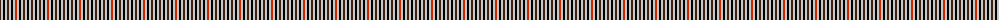

The parent of this is [Dupplin Check](/tartans/ka/2/n2/k2/n2/ka2/n2/k2/n2/r/2/)

This was sourced from register-of-tartans.  It is a [9 stripes tartan](/stripes/stripes9/).

Original link https://www.tartanregister.gov.uk/tartanDetails.aspx?ref=1050

## Thread count
Ka/2 N2 K2 N2 Ka2 N2 K2 N2 R/2

## Palette
Each colour and its ΔE from the base-6 reference it is a variant of.

| Colour | Shade | Base | ΔE (OKLab) |
|---|---|---|---|
| K |  `#000000` | K  | 0.00 |
| Ka |  `#3C2010` | B  | 0.20 |
| N |  `#C8C8C8` | W  | 0.13 |
| R |  `#C82800` | R  | 0.03 |

ID: /variants/ka/2/n2/k2/n2/ka2/n2/k2/n2/r/2-k000000-ka3c2010-nc8c8c8-rc82800/
