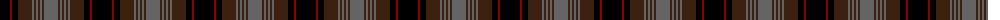

The parent of this is [Lunar](/tartans/ka/20/dr2/ka6/k14/n2/k2/n2/k2/n2/k2/n/14/)

This was sourced from register-of-tartans.  It is a [11 stripes tartan](/stripes/stripes11/).

Original link https://www.tartanregister.gov.uk/tartanDetails.aspx?ref=2248

## Thread count
Ka/20 DR2 Ka6 K14 N2 K2 N2 K2 N2 K2 N/14

## Palette
Each colour and its ΔE from the base-6 reference it is a variant of.

| Colour | Shade | Base | ΔE (OKLab) |
|---|---|---|---|
| DR |  `#8C0000` | R  | 0.13 |
| K |  `#3C2010` | B  | 0.20 |
| Ka |  `#000000` | K  | 0.00 |
| N |  `#646464` | B  | 0.16 |

ID: /variants/ka/20/dr2/ka6/k14/n2/k2/n2/k2/n2/k2/n/14-dr8c0000-k3c2010-ka000000-n646464/
