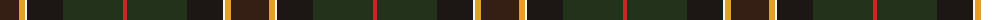

The parent of this is [Cornish Countryside](/tartans/ka/38/y6/w2/k36/kb60/r/4/)

This was sourced from register-of-tartans.  It is a [6 stripes tartan](/stripes/stripes6/).

Original link https://www.tartanregister.gov.uk/tartanDetails.aspx?ref=10240

## Thread count
Ka/38 Y6 W2 K36 Kb60 R/4

## Palette
Each colour and its ΔE from the base-6 reference it is a variant of.

| Colour | Shade | Base | ΔE (OKLab) |
|---|---|---|---|
| K |  `#1C1714` | K  | 0.21 |
| Ka |  `#351E14` | B  | 0.20 |
| Kb |  `#23321B` | G  | 0.17 |
| R |  `#CA2625` | R  | 0.03 |
| W |  `#F9F5EF` | W  | 0.01 |
| Y |  `#E0A126` | Y  | 0.08 |

# Sample pattern

ID: /variants/ka/38/y6/w2/k36/kb60/r/4-k1c1714-ka351e14-kb23321b-rca2625-wf9f5ef-ye0a126/
