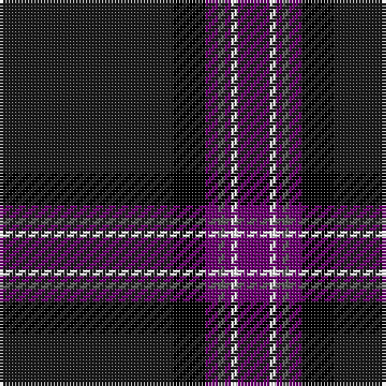

The parent of this is [Caledonian Mist](/tartans/ka/54/k10/p4/n2/p2/w2/p/10/)

This was sourced from register-of-tartans.  It is a [7 stripes tartan](/stripes/stripes7/).

Original link https://www.tartanregister.gov.uk/tartanDetails.aspx?ref=11287

## Thread count
Ka/54 K10 P4 N2 P2 W2 P/10

## Palette
Each colour and its ΔE from the base-6 reference it is a variant of.

| Colour | Shade | Base | ΔE (OKLab) |
|---|---|---|---|
| K |  `#000000` | K  | 0.00 |
| Ka |  `#1C1C1C` | B  | 0.20 |
| N |  `#5C5C5C` | B  | 0.14 |
| P |  `#6C0070` | B  | 0.15 |
| W |  `#FCFCFC` | W  | 0.03 |

# Sample pattern

ID: /variants/ka/54/k10/p4/n2/p2/w2/p/10-k000000-ka1c1c1c-n5c5c5c-p6c0070-wfcfcfc/
