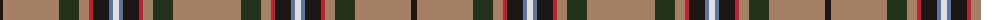

The parent of this is [Lambert (Front Royal) Hunting Name Tartan Tartan Number: 10663. Earliest known date: 29/07/2012 Designed by Charles Lambert,using the Scotweb Tartan Designer, for his family, to celebrate their Scottish and Irish ancestry. Mr Lambert has also designed the Lambert (Front Royal) Dress tartan(STR #10661) and the Lambert (Front Royal) Dark Night tartan (STR #10669) using the same geometry. See products available Copyright © Blair Urquhart, Comrie, 2015](/tartans/ka/6/lt56/k20/lt10/r4/ka16/b4/ln6/b4/ka16/r4/lt10/k20/lt/68/)

This was sourced from house-of-tartan.  It is a [14 stripes tartan](/stripes/stripes14/).

Original link http://www.house-of-tartan.scotland.net/house/TartanViewjs.asp?colr=Def&tnam=10663

## Thread count
Ka/6 LT56 K20 LT10 R4 Ka16 B4 LN6 B4 Ka16 R4 LT10 K20 LT/68

## Palette
Each colour and its ΔE from the base-6 reference it is a variant of.

| Colour | Shade | Base | ΔE (OKLab) |
|---|---|---|---|
| B |  `#5F749C` | B  | 0.17 |
| K |  `#23321B` | G  | 0.17 |
| Ka |  `#1C1714` | K  | 0.21 |
| LN |  `#E0E0E0` | W  | 0.06 |
| LT |  `#A58065` | R  | 0.20 |
| R |  `#B62531` | R  | 0.04 |

ID: /variants/ka/6/lt56/k20/lt10/r4/ka16/b4/ln6/b4/ka16/r4/lt10/k20/lt/68-b5f749c-k23321b-ka1c1714-lne0e0e0-lta58065-rb62531/
