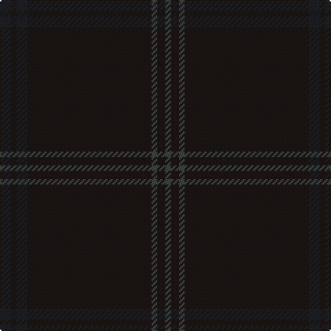

The parent of this is [STLTH](/tartans/ka/8/k4/ka8/k90/n4/k6/n/4/)

This was sourced from register-of-tartans.  It is a [7 stripes tartan](/stripes/stripes7/).

Original link https://www.tartanregister.gov.uk/tartanDetails.aspx?ref=10752

## Thread count
Ka/8 K4 Ka8 K90 N4 K6 N/4

## Palette
Each colour and its ΔE from the base-6 reference it is a variant of.

| Colour | Shade | Base | ΔE (OKLab) |
|---|---|---|---|
| K |  `#1C1714` | K  | 0.21 |
| Ka |  `#1E2025` | B  | 0.18 |
| N |  `#3F4441` | B  | 0.12 |

# Sample pattern

ID: /variants/ka/8/k4/ka8/k90/n4/k6/n/4-k1c1714-ka1e2025-n3f4441/
