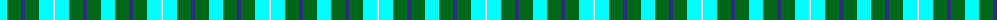

The parent of this is [Norwich No.078](/tartans/lb/14/ga14/dba4/ga14/lb14/wa/2/)

This was sourced from register-of-tartans.  It is a [6 stripes tartan](/stripes/stripes6/).

Original link https://www.tartanregister.gov.uk/tartanDetails.aspx?ref=3195

## Thread count
LB/14 Ga14 DBa4 Ga14 LB14 Wa/2

## Palette
Each colour and its ΔE from the base-6 reference it is a variant of.

| Colour | Shade | Base | ΔE (OKLab) |
|---|---|---|---|
| DB |  `#000048` | B  | 0.21 |
| DBa |  `#2C2C80` | B  | 0.05 |
| G |  `#647C00` | G  | 0.12 |
| Ga |  `#006818` | G  | 0.02 |
| LB |  `#00FCFC` | W  | 0.17 |
| W |  `#FCFCFC` | W  | 0.03 |
| Wa |  `#FCFCFC` | W  | 0.03 |

# Sample pattern

ID: /variants/lb/14/ga14/dba4/ga14/lb14/wa/2-db000048-dba2c2c80-g647c00-ga006818-lb00fcfc-wfcfcfc-wafcfcfc/
