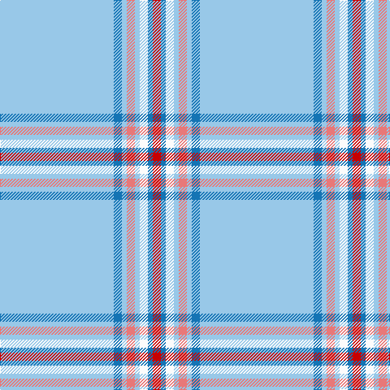

The parent of this is [Wyckoff (Commemorative)](/tartans/lb/140/b10/lb6/lr10/lb6/w10/b6/r/10/)

This was sourced from tartans-authority.  It is a [8 stripes tartan](/stripes/stripes8/).

Original link http://www.tartansauthority.com/tartan-ferret/display/10610/

## Thread count
LB/140 B10 LB6 LR10 LB6 W10 B6 R/10

## Palette
Each colour and its ΔE from the base-6 reference it is a variant of.

| Colour | Shade | Base | ΔE (OKLab) |
|---|---|---|---|
| B |  `#1474B4` | B  | 0.15 |
| LB |  `#98C8E8` | W  | 0.17 |
| LR |  `#E87878` | R  | 0.19 |
| R |  `#C80000` | R  | 0.00 |
| W |  `#FCFCFC` | W  | 0.03 |

# Sample pattern

ID: /variants/lb/140/b10/lb6/lr10/lb6/w10/b6/r/10-b1474b4-lb98c8e8-lre87878-rc80000-wfcfcfc/
