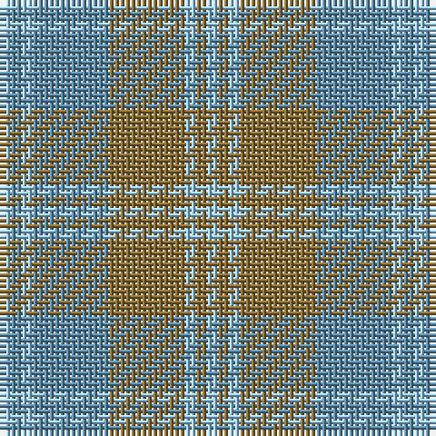

The parent of this is [Auld Lang Syne (Fashion)](/tartans/lb/2/b2/lb2/b14/lt14/lb2/lt2/lb/2/)

This was sourced from tartans-authority.  It is a [8 stripes tartan](/stripes/stripes8/).

Original link http://www.tartansauthority.com/tartan-ferret/display/3580/

## Thread count
LB/2 B2 LB2 B14 LT14 LB2 LT2 LB/2

## Palette
Each colour and its ΔE from the base-6 reference it is a variant of.

| Colour | Shade | Base | ΔE (OKLab) |
|---|---|---|---|
| B |  `#5C8CA8` | B  | 0.23 |
| LB |  `#98C8E8` | W  | 0.17 |
| LT |  `#8C7038` | G  | 0.18 |

# Sample pattern

ID: /variants/lb/2/b2/lb2/b14/lt14/lb2/lt2/lb/2-b5c8ca8-lb98c8e8-lt8c7038/
