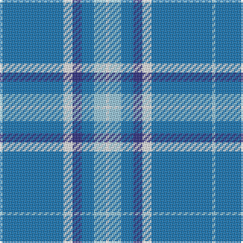

The parent of this is [Starr (Name)](/tartans/lb/2/b40/w6/db6/b8/lb8/w/2/)

This was sourced from tartans-authority.  It is a [7 stripes tartan](/stripes/stripes7/).

Original link http://www.tartansauthority.com/tartan-ferret/display/6373/

## Thread count
LB/2 B40 W6 DB6 B8 LB8 W/2

## Palette
Each colour and its ΔE from the base-6 reference it is a variant of.

| Colour | Shade | Base | ΔE (OKLab) |
|---|---|---|---|
| B |  `#1474B4` | B  | 0.15 |
| DB |  `#2C2C80` | B  | 0.05 |
| LB |  `#98C8E8` | W  | 0.17 |
| W |  `#F8F8F8` | W  | 0.01 |

# Sample pattern

ID: /variants/lb/2/b40/w6/db6/b8/lb8/w/2-b1474b4-db2c2c80-lb98c8e8-wf8f8f8/
