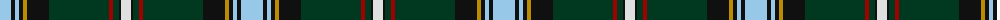

The parent of this is [Labrador District Tartan Tartan Number: 10004. Earliest known date: Feb. 2009 Officially adopted by the combined Councils of Labrador in February 2010. This tartan has been designed to celebrate the Labrador Scottish Heritage. See products available Copyright © Blair Urquhart, Comrie, 2015](/tartans/lb/22/k4/lb4/k4/dy4/k22/dg60/dr4/dg6/k2/ln/10/)

This was sourced from house-of-tartan.  It is a [11 stripes tartan](/stripes/stripes11/).

Original link http://www.house-of-tartan.scotland.net/house/TartanViewjs.asp?colr=Def&tnam=10004

## Thread count
LB/22 K4 LB4 K4 DY4 K22 DG60 DR4 DG6 K2 LN/10

## Palette
Each colour and its ΔE from the base-6 reference it is a variant of.

| Colour | Shade | Base | ΔE (OKLab) |
|---|---|---|---|
| DG |  `#003820` | G  | 0.16 |
| DR |  `#A00000` | R  | 0.09 |
| DY |  `#BC8C00` | Y  | 0.16 |
| K |  `#101010` | K  | 0.17 |
| LB |  `#98C8E8` | W  | 0.17 |
| LN |  `#E0E0E0` | W  | 0.06 |

ID: /variants/lb/22/k4/lb4/k4/dy4/k22/dg60/dr4/dg6/k2/ln/10-dg003820-dra00000-dybc8c00-k101010-lb98c8e8-lne0e0e0/
