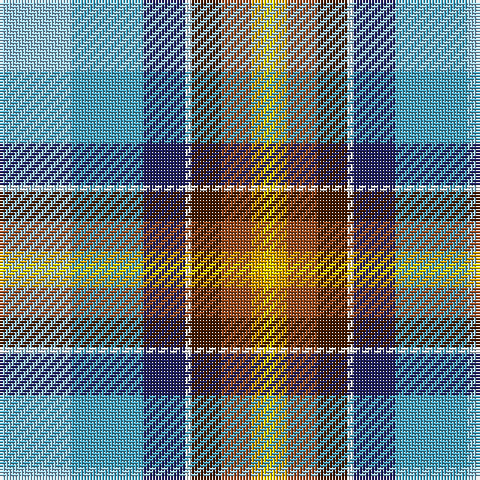

The parent of this is [Isle of Jura](/tartans/lb/24/b24/db14/w2/dr10/t10/dy4/y/4/)

This was sourced from tartans-authority.  It is a [8 stripes tartan](/stripes/stripes8/).

Original link http://www.tartansauthority.com/tartan-ferret/display/11250/

## Thread count
LB/24 B24 DB14 W2 DR10 T10 DY4 Y/4

## Palette
Each colour and its ΔE from the base-6 reference it is a variant of.

| Colour | Shade | Base | ΔE (OKLab) |
|---|---|---|---|
| B |  `#48A4C0` | Y  | 0.28 |
| DB |  `#202060` | B  | 0.11 |
| DR |  `#441800` | B  | 0.22 |
| DY |  `#D09800` | Y  | 0.11 |
| LB |  `#98C8E8` | W  | 0.17 |
| T |  `#98481C` | R  | 0.11 |
| W |  `#FCFCFC` | W  | 0.03 |
| Y |  `#FCCC00` | Y  | 0.04 |

# Sample pattern

ID: /variants/lb/24/b24/db14/w2/dr10/t10/dy4/y/4-b48a4c0-db202060-dr441800-dyd09800-lb98c8e8-t98481c-wfcfcfc-yfccc00/
