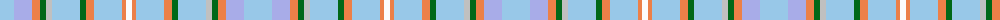

The parent of this is [Bouguet, Adrian (Personal)](/tartans/lb/28/lp18/o8/g6/n6/lb28/g6/o8/lb28/o4/w/6/)

This was sourced from tartans-authority.  It is a [11 stripes tartan](/stripes/stripes11/).

Original link http://www.tartansauthority.com/tartan-ferret/display/11263/

## Thread count
LB/28 LP18 O8 G6 N6 LB28 G6 O8 LB28 O4 W/6

## Palette
Each colour and its ΔE from the base-6 reference it is a variant of.

| Colour | Shade | Base | ΔE (OKLab) |
|---|---|---|---|
| G |  `#006818` | G  | 0.02 |
| LB |  `#98C8E8` | W  | 0.17 |
| LP |  `#A8ACE8` | W  | 0.22 |
| N |  `#C0C0C0` | W  | 0.16 |
| O |  `#EC8048` | Y  | 0.17 |
| W |  `#FCFCFC` | W  | 0.03 |

ID: /variants/lb/28/lp18/o8/g6/n6/lb28/g6/o8/lb28/o4/w/6-g006818-lb98c8e8-lpa8ace8-nc0c0c0-oec8048-wfcfcfc/
