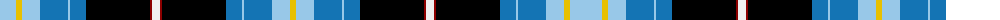

The parent of this is [Wrens Corporate Tartan Tartan Number: 2345. Earliest known date: 1995 Popularly known as the Wrens. Lochcarron swatch. See products available Copyright © Blair Urquhart, Comrie, 2015](/tartans/lb/32/ya6/lb18/ba28/lb2/ba16/k64/dr2/w8/dr2/k64/ba16/lb2/ba28/lb18/ya/6/)

This was sourced from house-of-tartan.  It is a [16 stripes tartan](/stripes/stripes16/).

Original link http://www.house-of-tartan.scotland.net/house/TartanViewjs.asp?colr=Def&tnam=2345

## Thread count
LB/32 Ya6 LB18 Ba28 LB2 Ba16 K64 DR2 W8 DR2 K64 Ba16 LB2 Ba28 LB18 Ya/6

## Palette
Each colour and its ΔE from the base-6 reference it is a variant of.

| Colour | Shade | Base | ΔE (OKLab) |
|---|---|---|---|
| B |  `#788CB4` | B  | 0.25 |
| Ba |  `#1474B4` | B  | 0.15 |
| DB |  `#00008C` | B  | 0.13 |
| DR |  `#8C0000` | R  | 0.13 |
| G |  `#007800` | G  | 0.06 |
| K |  `#000000` | K  | 0.00 |
| LB |  `#98C8E8` | W  | 0.17 |
| P |  `#64008C` | B  | 0.13 |
| W |  `#F0F0F0` | W  | 0.01 |
| Y |  `#DCC000` | Y  | 0.02 |
| Ya |  `#E8C000` | Y  | 0.00 |

ID: /variants/lb/32/ya6/lb18/ba28/lb2/ba16/k64/dr2/w8/dr2/k64/ba16/lb2/ba28/lb18/ya/6-b788cb4-ba1474b4-db00008c-dr8c0000-g007800-k000000-lb98c8e8-p64008c-wf0f0f0-ydcc000-yae8c000/
