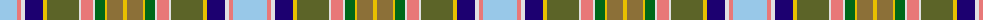

The parent of this is [Okanagan(District)](/tartans/lb/34/lr4/ln4/db18/y4/ga32/ln2/lr12/ln2/g10/y2/lt16/y/4/)

This was sourced from tartans-authority.  It is a [13 stripes tartan](/stripes/stripes13/).

Original link http://www.tartansauthority.com/tartan-ferret/display/7700/

## Thread count
LB/34 LR4 LN4 DB18 Y4 Ga32 LN2 LR12 LN2 G10 Y2 LT16 Y/4

## Palette
Each colour and its ΔE from the base-6 reference it is a variant of.

| Colour | Shade | Base | ΔE (OKLab) |
|---|---|---|---|
| DB |  `#1C0070` | B  | 0.14 |
| G |  `#006818` | G  | 0.02 |
| Ga |  `#5C6428` | G  | 0.09 |
| LB |  `#98C8E8` | W  | 0.17 |
| LN |  `#E0E0E0` | W  | 0.06 |
| LR |  `#E87878` | R  | 0.19 |
| LT |  `#8C7038` | G  | 0.18 |
| Y |  `#E8C000` | Y  | 0.00 |

ID: /variants/lb/34/lr4/ln4/db18/y4/ga32/ln2/lr12/ln2/g10/y2/lt16/y/4-db1c0070-g006818-ga5c6428-lb98c8e8-lne0e0e0-lre87878-lt8c7038-ye8c000/
