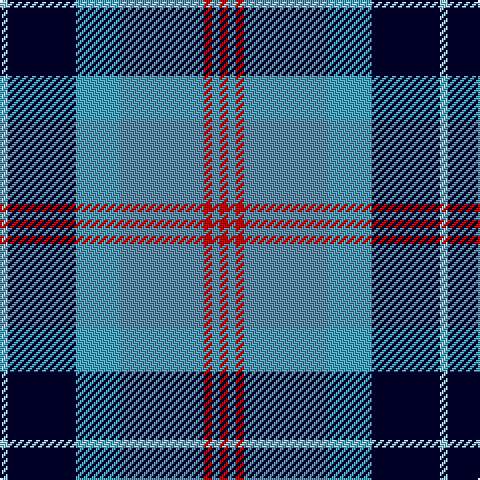

The parent of this is [Loch Ness (Fashion)](/tartans/lb/4/db34/ba22/b42/r4/b4/r/4/)

This was sourced from tartans-authority.  It is a [7 stripes tartan](/stripes/stripes7/).

Original link http://www.tartansauthority.com/tartan-ferret/display/5450/

## Thread count
LB/4 DB34 Ba22 B42 R4 B4 R/4

## Palette
Each colour and its ΔE from the base-6 reference it is a variant of.

| Colour | Shade | Base | ΔE (OKLab) |
|---|---|---|---|
| B |  `#5C8CA8` | B  | 0.23 |
| Ba |  `#48A4C0` | Y  | 0.28 |
| DB |  `#00002C` | K  | 0.16 |
| LB |  `#98C8E8` | W  | 0.17 |
| R |  `#C80000` | R  | 0.00 |

# Sample pattern

ID: /variants/lb/4/db34/ba22/b42/r4/b4/r/4-b5c8ca8-ba48a4c0-db00002c-lb98c8e8-rc80000/
