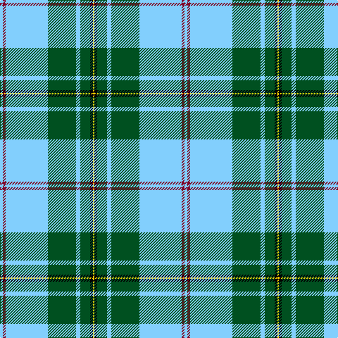

The parent of this is [L'Abeille du Cercle de Fermières Sainte-Geneviève-de-Sainte-Foy](/tartans/lb/4/dr4/lb60/g40/lb6/g14/k4/y/2/)

This was sourced from register-of-tartans.  It is a [8 stripes tartan](/stripes/stripes8/).

Original link https://www.tartanregister.gov.uk/tartanDetails.aspx?ref=11614

## Thread count
LB/4 DR4 LB60 G40 LB6 G14 K4 Y/2

## Palette
Each colour and its ΔE from the base-6 reference it is a variant of.

| Colour | Shade | Base | ΔE (OKLab) |
|---|---|---|---|
| DR |  `#800028` | R  | 0.16 |
| G |  `#005020` | G  | 0.08 |
| K |  `#000000` | K  | 0.00 |
| LB |  `#82CFFD` | W  | 0.18 |
| Y |  `#FCCC00` | Y  | 0.04 |

# Sample pattern

ID: /variants/lb/4/dr4/lb60/g40/lb6/g14/k4/y/2-dr800028-g005020-k000000-lb82cffd-yfccc00/
