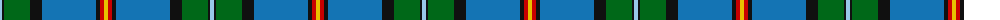
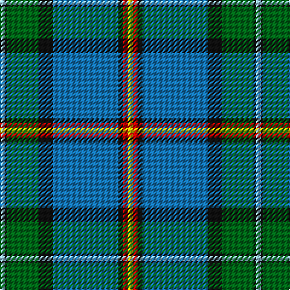

The parent of this is [German MacLeod (Corporate)](/tartans/lb/4/k2/g26/k12/b54/k4/r4/y/4/)

This was sourced from tartans-authority.  It is a [8 stripes tartan](/stripes/stripes8/).

Original link http://www.tartansauthority.com/tartan-ferret/display/6816/

## Thread count
LB/4 K2 G26 K12 B54 K4 R4 Y/4

## Palette
Each colour and its ΔE from the base-6 reference it is a variant of.

| Colour | Shade | Base | ΔE (OKLab) |
|---|---|---|---|
| B |  `#1474B4` | B  | 0.15 |
| G |  `#006818` | G  | 0.02 |
| K |  `#101010` | K  | 0.17 |
| LB |  `#98C8E8` | W  | 0.17 |
| R |  `#C80000` | R  | 0.00 |
| Y |  `#E8C000` | Y  | 0.00 |

# Sample pattern

ID: /variants/lb/4/k2/g26/k12/b54/k4/r4/y/4-b1474b4-g006818-k101010-lb98c8e8-rc80000-ye8c000/
