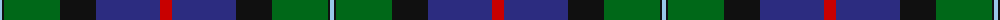
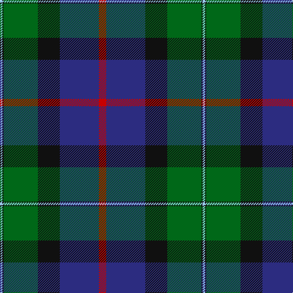

The parent of this is [Naysmith (Name)](/tartans/lb/4/k2/g56/k36/db64/r/12/)

This was sourced from tartans-authority.  It is a [6 stripes tartan](/stripes/stripes6/).

Original link http://www.tartansauthority.com/tartan-ferret/display/8222/

## Thread count
LB/4 K2 G56 K36 DB64 R/12

## Palette
Each colour and its ΔE from the base-6 reference it is a variant of.

| Colour | Shade | Base | ΔE (OKLab) |
|---|---|---|---|
| DB |  `#2C2C80` | B  | 0.05 |
| G |  `#006818` | G  | 0.02 |
| K |  `#101010` | K  | 0.17 |
| LB |  `#98C8E8` | W  | 0.17 |
| R |  `#C80000` | R  | 0.00 |

# Sample pattern

ID: /variants/lb/4/k2/g56/k36/db64/r/12-db2c2c80-g006818-k101010-lb98c8e8-rc80000/
