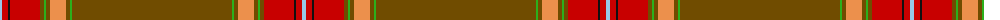

The parent of this is [Drovers' Tryst (Corporate)](/tartans/lb/4/r6/k2/r30/t4/g2/t4/o16/t4/g2/t/160/)

This was sourced from tartans-authority.  It is a [11 stripes tartan](/stripes/stripes11/).

Original link http://www.tartansauthority.com/tartan-ferret/display/8249/

## Thread count
LB/4 R6 K2 R30 T4 G2 T4 O16 T4 G2 T/160

## Palette
Each colour and its ΔE from the base-6 reference it is a variant of.

| Colour | Shade | Base | ΔE (OKLab) |
|---|---|---|---|
| G |  `#2CB01C` | Y  | 0.22 |
| K |  `#101010` | K  | 0.17 |
| LB |  `#98C8E8` | W  | 0.17 |
| O |  `#EC904C` | Y  | 0.13 |
| R |  `#C80000` | R  | 0.00 |
| T |  `#704C00` | G  | 0.14 |

ID: /variants/lb/4/r6/k2/r30/t4/g2/t4/o16/t4/g2/t/160-g2cb01c-k101010-lb98c8e8-oec904c-rc80000-t704c00/
