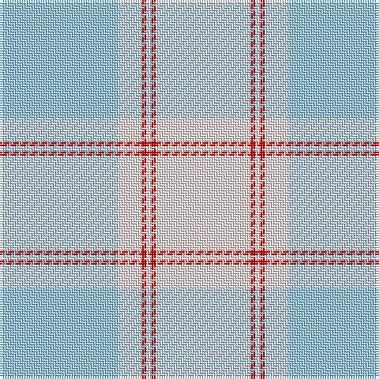

The parent of this is [Masai Shuka 13 (Artefact)](/tartans/lb/50/ln10/r2/ln2/r2/ln/40/)

This was sourced from tartans-authority.  It is a [6 stripes tartan](/stripes/stripes6/).

Original link http://www.tartansauthority.com/tartan-ferret/display/7203/

## Thread count
LB/50 LN10 R2 LN2 R2 LN/40

## Palette
Each colour and its ΔE from the base-6 reference it is a variant of.

| Colour | Shade | Base | ΔE (OKLab) |
|---|---|---|---|
| LB |  `#98C8E8` | W  | 0.17 |
| LN |  `#F8E4E4` | W  | 0.04 |
| R |  `#C80000` | R  | 0.00 |

# Sample pattern

ID: /variants/lb/50/ln10/r2/ln2/r2/ln/40-lb98c8e8-lnf8e4e4-rc80000/
