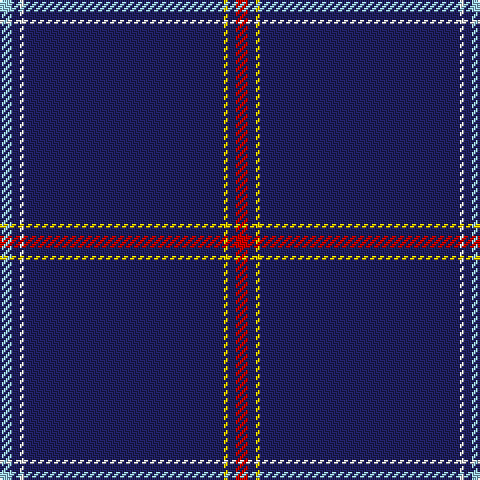

The parent of this is [Easton (2014)](/tartans/lb/6/db4/w2/db100/y2/db4/r/6/)

This was sourced from tartans-authority.  It is a [7 stripes tartan](/stripes/stripes7/).

Original link http://www.tartansauthority.com/tartan-ferret/display/11121/

## Thread count
LB/6 DB4 W2 DB100 Y2 DB4 R/6

## Palette
Each colour and its ΔE from the base-6 reference it is a variant of.

| Colour | Shade | Base | ΔE (OKLab) |
|---|---|---|---|
| DB |  `#202060` | B  | 0.11 |
| LB |  `#98C8E8` | W  | 0.17 |
| R |  `#C80000` | R  | 0.00 |
| W |  `#FCFCFC` | W  | 0.03 |
| Y |  `#FCCC00` | Y  | 0.04 |

# Sample pattern

ID: /variants/lb/6/db4/w2/db100/y2/db4/r/6-db202060-lb98c8e8-rc80000-wfcfcfc-yfccc00/
