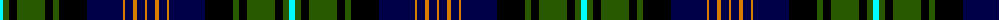

The parent of this is [Clerke of Ulva](/tartans/lb/6/g6/k8/g28/k8/g6/k28/db36/o2/db8/o4/db8/o/2/)

This was sourced from register-of-tartans.  It is a [13 stripes tartan](/stripes/stripes13/).

Original link https://www.tartanregister.gov.uk/tartanDetails.aspx?ref=686

## Thread count
LB/6 G6 K8 G28 K8 G6 K28 DB36 O2 DB8 O4 DB8 O/2

## Palette
Each colour and its ΔE from the base-6 reference it is a variant of.

| Colour | Shade | Base | ΔE (OKLab) |
|---|---|---|---|
| DB |  `#000048` | B  | 0.21 |
| G |  `#285800` | G  | 0.04 |
| K |  `#000000` | K  | 0.00 |
| LB |  `#00FCFC` | W  | 0.17 |
| O |  `#D87C00` | Y  | 0.17 |

ID: /variants/lb/6/g6/k8/g28/k8/g6/k28/db36/o2/db8/o4/db8/o/2-db000048-g285800-k000000-lb00fcfc-od87c00/
