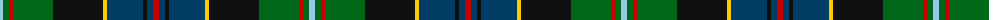

The parent of this is [Loch Freuchie (District)](/tartans/lb/6/g6/r4/g40/k50/y4/db36/k4/db6/r/6/)

This was sourced from tartans-authority.  It is a [10 stripes tartan](/stripes/stripes10/).

Original link http://www.tartansauthority.com/tartan-ferret/display/10725/

## Thread count
LB/6 G6 R4 G40 K50 Y4 DB36 K4 DB6 R/6

## Palette
Each colour and its ΔE from the base-6 reference it is a variant of.

| Colour | Shade | Base | ΔE (OKLab) |
|---|---|---|---|
| DB |  `#003C64` | B  | 0.07 |
| G |  `#006818` | G  | 0.02 |
| K |  `#101010` | K  | 0.17 |
| LB |  `#98C8E8` | W  | 0.17 |
| R |  `#C80000` | R  | 0.00 |
| Y |  `#FCCC00` | Y  | 0.04 |

ID: /variants/lb/6/g6/r4/g40/k50/y4/db36/k4/db6/r/6-db003c64-g006818-k101010-lb98c8e8-rc80000-yfccc00/
