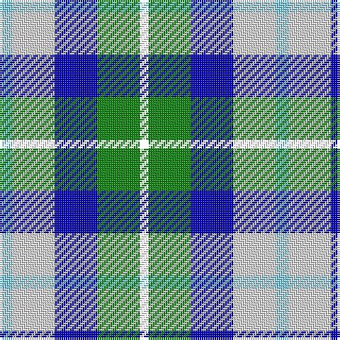

The parent of this is [MacTeddy](/tartans/lb/6/ln20/b20/g20/r/4/)

This was sourced from register-of-tartans.  It is a [5 stripes tartan](/stripes/stripes5/).

Original link https://www.tartanregister.gov.uk/tartanDetails.aspx?ref=2771

## Thread count
LB/6 LN20 B20 G20 R/4

## Palette
Each colour and its ΔE from the base-6 reference it is a variant of.

| Colour | Shade | Base | ΔE (OKLab) |
|---|---|---|---|
| B |  `#0000CD` | B  | 0.15 |
| G |  `#008B00` | G  | 0.12 |
| LB |  `#82CFFD` | W  | 0.18 |
| LN |  `#E0E0E0` | W  | 0.06 |

# Sample pattern

ID: /variants/lb/6/ln20/b20/g20/r/4-b0000cd-g008b00-lb82cffd-lne0e0e0/
