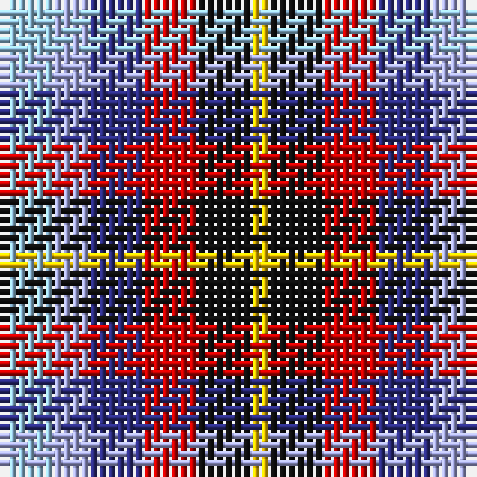

The parent of this is [Becker (Name)](/tartans/lb/6/lp4/db6/r6/k6/y/2/)

This was sourced from tartans-authority.  It is a [6 stripes tartan](/stripes/stripes6/).

Original link http://www.tartansauthority.com/tartan-ferret/display/8570/

## Thread count
LB/6 LP4 DB6 R6 K6 Y/2

## Palette
Each colour and its ΔE from the base-6 reference it is a variant of.

| Colour | Shade | Base | ΔE (OKLab) |
|---|---|---|---|
| DB |  `#2C2C80` | B  | 0.05 |
| K |  `#101010` | K  | 0.17 |
| LB |  `#98C8E8` | W  | 0.17 |
| LP |  `#A8ACE8` | W  | 0.22 |
| R |  `#C80000` | R  | 0.00 |
| Y |  `#FCCC00` | Y  | 0.04 |

# Sample pattern

ID: /variants/lb/6/lp4/db6/r6/k6/y/2-db2c2c80-k101010-lb98c8e8-lpa8ace8-rc80000-yfccc00/
