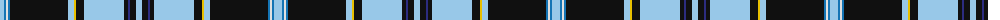

The parent of this is [Silverton (Name)](/tartans/lb/8/b2/ln2/b2/k58/lb6/y2/k8/lb40/k4/db2/k6/lb/6/)

This was sourced from tartans-authority.  It is a [13 stripes tartan](/stripes/stripes13/).

Original link http://www.tartansauthority.com/tartan-ferret/display/10275/

## Thread count
LB/8 B2 LN2 B2 K58 LB6 Y2 K8 LB40 K4 DB2 K6 LB/6

## Palette
Each colour and its ΔE from the base-6 reference it is a variant of.

| Colour | Shade | Base | ΔE (OKLab) |
|---|---|---|---|
| B |  `#1474B4` | B  | 0.15 |
| DB |  `#2C2C80` | B  | 0.05 |
| K |  `#101010` | K  | 0.17 |
| LB |  `#98C8E8` | W  | 0.17 |
| LN |  `#E0E0E0` | W  | 0.06 |
| Y |  `#E8C000` | Y  | 0.00 |

ID: /variants/lb/8/b2/ln2/b2/k58/lb6/y2/k8/lb40/k4/db2/k6/lb/6-b1474b4-db2c2c80-k101010-lb98c8e8-lne0e0e0-ye8c000/
