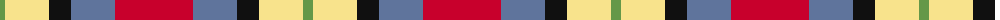

The parent of this is [Abbink, Ingmar (Personal)](/tartans/lg/10/ly44/k22/b44/r/78/)

This was sourced from register-of-tartans.  It is a [5 stripes tartan](/stripes/stripes5/).

Original link https://www.tartanregister.gov.uk/tartanDetails.aspx?ref=11071

## Thread count
LG/10 LY44 K22 B44 R/78

## Palette
Each colour and its ΔE from the base-6 reference it is a variant of.

| Colour | Shade | Base | ΔE (OKLab) |
|---|---|---|---|
| B |  `#5F749C` | B  | 0.17 |
| K |  `#101010` | K  | 0.17 |
| LG |  `#649848` | G  | 0.19 |
| LY |  `#F8E38C` | Y  | 0.11 |
| R |  `#C8002C` | R  | 0.03 |

# Sample pattern

ID: /variants/lg/10/ly44/k22/b44/r/78-b5f749c-k101010-lg649848-lyf8e38c-rc8002c/
