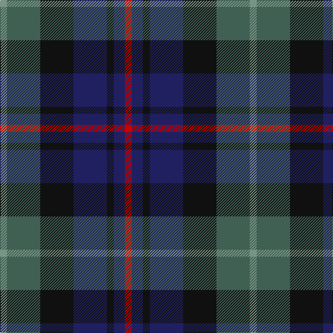

The parent of this is [Heritage (Corporate)](/tartans/lg/10/n48/k48/db48/k10/db16/r/10/)

This was sourced from tartans-authority.  It is a [7 stripes tartan](/stripes/stripes7/).

Original link http://www.tartansauthority.com/tartan-ferret/display/6014/

## Thread count
LG/10 N48 K48 DB48 K10 DB16 R/10

## Palette
Each colour and its ΔE from the base-6 reference it is a variant of.

| Colour | Shade | Base | ΔE (OKLab) |
|---|---|---|---|
| DB |  `#202060` | B  | 0.11 |
| K |  `#101010` | K  | 0.17 |
| LG |  `#789484` | G  | 0.23 |
| N |  `#406054` | G  | 0.11 |
| R |  `#C80000` | R  | 0.00 |

# Sample pattern

ID: /variants/lg/10/n48/k48/db48/k10/db16/r/10-db202060-k101010-lg789484-n406054-rc80000/
