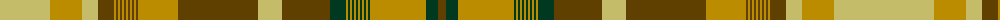

The parent of this is [Alberta (CIDD 28106)](/tartans/lg/100/dy32/lg16/t16/dy2/t2/dy2/t2/dy2/t2/dy2/t2/dy2/t2/dy2/t2/dy40/t80/lg24/t48/dg16/dy2/dg2/dy2/dg2/dy2/dg2/dy2/dg2/dy2/dg2/dy2/dg2/dy56/dg12/t/8/)

This was sourced from register-of-tartans.  It is a [36 stripes tartan](/stripes/stripes36/).

Original link https://www.tartanregister.gov.uk/tartanDetails.aspx?ref=5704

## Thread count
LG/100 DY32 LG16 T16 DY2 T2 DY2 T2 DY2 T2 DY2 T2 DY2 T2 DY2 T2 DY40 T80 LG24 T48 DG16 DY2 DG2 DY2 DG2 DY2 DG2 DY2 DG2 DY2 DG2 DY2 DG2 DY56 DG12 T/8

## Palette
Each colour and its ΔE from the base-6 reference it is a variant of.

| Colour | Shade | Base | ΔE (OKLab) |
|---|---|---|---|
| B |  `#009894` | G  | 0.21 |
| DB |  `#2C2C80` | B  | 0.05 |
| DG |  `#003820` | G  | 0.16 |
| DR |  `#441800` | B  | 0.22 |
| DY |  `#BC8C00` | Y  | 0.16 |
| G |  `#289C18` | G  | 0.18 |
| Ga |  `#006818` | G  | 0.02 |
| K |  `#101010` | K  | 0.17 |
| LG |  `#C4BC68` | Y  | 0.07 |
| LN |  `#E0E0E0` | W  | 0.06 |
| R |  `#C80000` | R  | 0.00 |
| T |  `#604000` | G  | 0.14 |

ID: /variants/lg/100/dy32/lg16/t16/dy2/t2/dy2/t2/dy2/t2/dy2/t2/dy2/t2/dy2/t2/dy40/t80/lg24/t48/dg16/dy2/dg2/dy2/dg2/dy2/dg2/dy2/dg2/dy2/dg2/dy2/dg2/dy56/dg12/t/8-b009894-db2c2c80-dg003820-dr441800-dybc8c00-g289c18-ga006818-k101010-lgc4bc68-lne0e0e0-rc80000-t604000/
