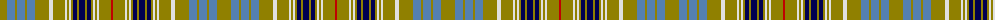

The parent of this is [Ottawa](/tartans/lg/14/b8/lg2/b8/lg2/b8/lg14/ln4/lg12/ln2/lg2/ln2/lg2/db4/lg2/db6/lg2/db4/lg2/ln2/lg2/ln2/lg12/r/2/)

This was sourced from weddslist.  It is a [24 stripes tartan](/stripes/stripes24/).

Original link http://www.weddslist.com/cgi-bin/tartans/pg.pl?source=sts

## Thread count
LG/14 B8 LG2 B8 LG2 B8 LG14 LN4 LG12 LN2 LG2 LN2 LG2 DB4 LG2 DB6 LG2 DB4 LG2 LN2 LG2 LN2 LG12 R/2

## Palette
Each colour and its ΔE from the base-6 reference it is a variant of.

| Colour | Shade | Base | ΔE (OKLab) |
|---|---|---|---|
| B |  `#5480B0` | B  | 0.20 |
| DB |  `#000050` | B  | 0.20 |
| LG |  `#908000` | G  | 0.19 |
| LN |  `#E0E0E0` | W  | 0.06 |
| R |  `#C00000` | R  | 0.02 |

ID: /variants/lg/14/b8/lg2/b8/lg2/b8/lg14/ln4/lg12/ln2/lg2/ln2/lg2/db4/lg2/db6/lg2/db4/lg2/ln2/lg2/ln2/lg12/r/2-b5480b0-db000050-lg908000-lne0e0e0-rc00000/
