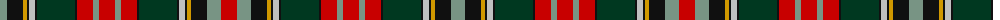

The parent of this is [Norwich No.001](/tartans/lg/14/k16/dy4/k2/n6/k2/dg38/k2/r16/lg6/r16/lg6/r16/k2/dg38/k2/n6/k2/dy4/k16/lg14/r/16/)

This was sourced from register-of-tartans.  It is a [22 stripes tartan](/stripes/stripes22/).

Original link https://www.tartanregister.gov.uk/tartanDetails.aspx?ref=3169

## Thread count
LG/14 K16 DY4 K2 N6 K2 DG38 K2 R16 LG6 R16 LG6 R16 K2 DG38 K2 N6 K2 DY4 K16 LG14 R/16

## Palette
Each colour and its ΔE from the base-6 reference it is a variant of.

| Colour | Shade | Base | ΔE (OKLab) |
|---|---|---|---|
| DG |  `#003820` | G  | 0.16 |
| DY |  `#D09800` | Y  | 0.11 |
| K |  `#101010` | K  | 0.17 |
| LG |  `#789484` | G  | 0.23 |
| N |  `#C0C0C0` | W  | 0.16 |
| R |  `#C80000` | R  | 0.00 |

ID: /variants/lg/14/k16/dy4/k2/n6/k2/dg38/k2/r16/lg6/r16/lg6/r16/k2/dg38/k2/n6/k2/dy4/k16/lg14/r/16-dg003820-dyd09800-k101010-lg789484-nc0c0c0-rc80000/
