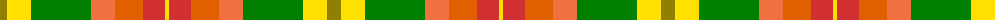

The parent of this is [Unidentified, Silk Plaid](/tartans/lg/14/y24/g60/o24/oa28/r22/y/4/)

This was sourced from weddslist.  It is a [7 stripes tartan](/stripes/stripes7/).

Original link http://www.weddslist.com/cgi-bin/tartans/pg.pl?source=sts

## Thread count
LG/14 Y24 G60 O24 Oa28 R22 Y/4

## Palette
Each colour and its ΔE from the base-6 reference it is a variant of.

| Colour | Shade | Base | ΔE (OKLab) |
|---|---|---|---|
| G |  `#008000` | G  | 0.09 |
| LG |  `#908000` | G  | 0.19 |
| O |  `#F07040` | R  | 0.18 |
| Oa |  `#E06000` | R  | 0.14 |
| R |  `#D03030` | R  | 0.05 |
| Y |  `#FFE000` | Y  | 0.09 |

# Sample pattern

ID: /variants/lg/14/y24/g60/o24/oa28/r22/y/4-g008000-lg908000-of07040-oae06000-rd03030-yffe000/
