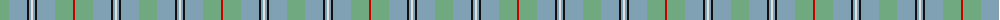

The parent of this is [Irving of Glentulchan (Personal)](/tartans/lg/18/ba18/k2/ba2/ln2/ba2/k2/ba18/lg18/r/2/)

This was sourced from register-of-tartans.  It is a [10 stripes tartan](/stripes/stripes10/).

Original link https://www.tartanregister.gov.uk/tartanDetails.aspx?ref=1861

## Thread count
LG/18 Ba18 K2 Ba2 LN2 Ba2 K2 Ba18 LG18 R/2

## Palette
Each colour and its ΔE from the base-6 reference it is a variant of.

| Colour | Shade | Base | ΔE (OKLab) |
|---|---|---|---|
| B |  `#7084AC` | B  | 0.22 |
| Ba |  `#80A0B4` | Y  | 0.24 |
| K |  `#101010` | K  | 0.17 |
| LG |  `#70A880` | Y  | 0.20 |
| LN |  `#E0E0E0` | W  | 0.06 |
| R |  `#C80000` | R  | 0.00 |
| W |  `#FCFCFC` | W  | 0.03 |

ID: /variants/lg/18/ba18/k2/ba2/ln2/ba2/k2/ba18/lg18/r/2-b7084ac-ba80a0b4-k101010-lg70a880-lne0e0e0-rc80000-wfcfcfc/
