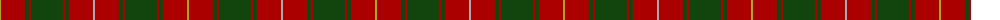

The parent of this is [MacPhie](/tartans/lg/2/dr24/dg4/dr2/dg32/dr2/dg4/dr24/n/2/)

This was sourced from weddslist.  It is a [9 stripes tartan](/stripes/stripes9/).

Original link http://www.weddslist.com/cgi-bin/tartans/pg.pl?source=tinsel

## Thread count
LG/2 DR24 DG4 DR2 DG32 DR2 DG4 DR24 N/2

## Palette
Each colour and its ΔE from the base-6 reference it is a variant of.

| Colour | Shade | Base | ΔE (OKLab) |
|---|---|---|---|
| DG |  `#11450D` | G  | 0.10 |
| DR |  `#AA0000` | R  | 0.06 |
| LG |  `#AAAA00` | Y  | 0.11 |
| N |  `#AAAAAA` | Y  | 0.19 |

ID: /variants/lg/2/dr24/dg4/dr2/dg32/dr2/dg4/dr24/n/2-dg11450d-draa0000-lgaaaa00-naaaaaa/
