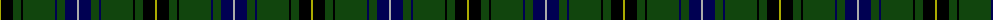

The parent of this is [Henderson](/tartans/lg/2/k12/dg8/k2/dg32/db2/dg8/db12/n/2/)

This was sourced from weddslist.  It is a [9 stripes tartan](/stripes/stripes9/).

Original link http://www.weddslist.com/cgi-bin/tartans/pg.pl?source=x

## Thread count
LG/2 K12 DG8 K2 DG32 DB2 DG8 DB12 N/2

## Palette
Each colour and its ΔE from the base-6 reference it is a variant of.

| Colour | Shade | Base | ΔE (OKLab) |
|---|---|---|---|
| DB |  `#000052` | B  | 0.20 |
| DG |  `#11450D` | G  | 0.10 |
| K |  `#000000` | K  | 0.00 |
| LG |  `#AAAA00` | Y  | 0.11 |
| N |  `#AAAAAA` | Y  | 0.19 |

ID: /variants/lg/2/k12/dg8/k2/dg32/db2/dg8/db12/n/2-db000052-dg11450d-k000000-lgaaaa00-naaaaaa/
