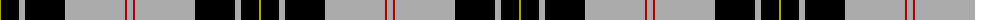

The parent of this is [MacPherson Dress](/tartans/lg/2/k18/n6/k40/n60/dr2/n/6/)

This was sourced from weddslist.  It is a [7 stripes tartan](/stripes/stripes7/).

Original link http://www.weddslist.com/cgi-bin/tartans/pg.pl?source=x

## Thread count
LG/2 K18 N6 K40 N60 DR2 N/6

## Palette
Each colour and its ΔE from the base-6 reference it is a variant of.

| Colour | Shade | Base | ΔE (OKLab) |
|---|---|---|---|
| DR |  `#AA0000` | R  | 0.06 |
| K |  `#000000` | K  | 0.00 |
| LG |  `#AAAA00` | Y  | 0.11 |
| N |  `#AAAAAA` | Y  | 0.19 |

# Sample pattern

ID: /variants/lg/2/k18/n6/k40/n60/dr2/n/6-draa0000-k000000-lgaaaa00-naaaaaa/
