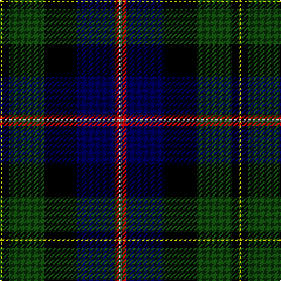

The parent of this is [MacNeil](/tartans/lg/2/k6/dg30/k28/db32/dr4/n/2/)

This was sourced from weddslist.  It is a [7 stripes tartan](/stripes/stripes7/).

Original link http://www.weddslist.com/cgi-bin/tartans/pg.pl?source=x

## Thread count
LG/2 K6 DG30 K28 DB32 DR4 N/2

## Palette
Each colour and its ΔE from the base-6 reference it is a variant of.

| Colour | Shade | Base | ΔE (OKLab) |
|---|---|---|---|
| DB |  `#000052` | B  | 0.20 |
| DG |  `#11450D` | G  | 0.10 |
| DR |  `#AA0000` | R  | 0.06 |
| K |  `#000000` | K  | 0.00 |
| LG |  `#AAAA00` | Y  | 0.11 |
| N |  `#AAAAAA` | Y  | 0.19 |

# Sample pattern

ID: /variants/lg/2/k6/dg30/k28/db32/dr4/n/2-db000052-dg11450d-draa0000-k000000-lgaaaa00-naaaaaa/
