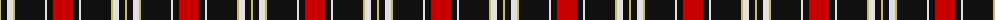
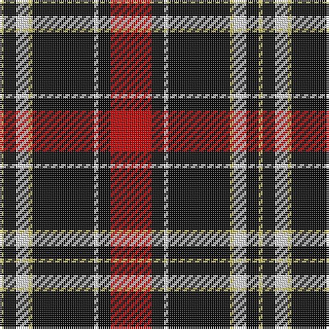

The parent of this is [Cunard o' the Clyde](/tartans/lg/2/k6/ln6/lg2/k30/ln2/k6/r/20/)

This was sourced from register-of-tartans.  It is a [8 stripes tartan](/stripes/stripes8/).

Original link https://www.tartanregister.gov.uk/tartanDetails.aspx?ref=11296

## Thread count
LG/2 K6 LN6 LG2 K30 LN2 K6 R/20

## Palette
Each colour and its ΔE from the base-6 reference it is a variant of.

| Colour | Shade | Base | ΔE (OKLab) |
|---|---|---|---|
| K |  `#101010` | K  | 0.17 |
| LG |  `#C4BC68` | Y  | 0.07 |
| LN |  `#E0E0E0` | W  | 0.06 |
| R |  `#C80000` | R  | 0.00 |

# Sample pattern

ID: /variants/lg/2/k6/ln6/lg2/k30/ln2/k6/r/20-k101010-lgc4bc68-lne0e0e0-rc80000/
