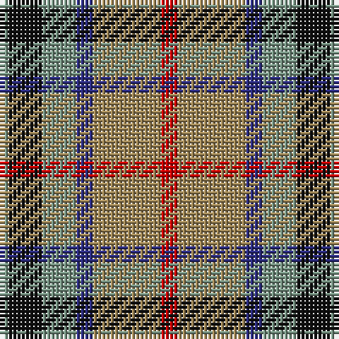

The parent of this is [Thompson (J.C.'s Fancy) (Personal)](/tartans/lg/2/k8/lg8/db4/lt16/r/4/)

This was sourced from tartans-authority.  It is a [6 stripes tartan](/stripes/stripes6/).

Original link http://www.tartansauthority.com/tartan-ferret/display/286/

## Thread count
LG/2 K8 LG8 DB4 LT16 R/4

## Palette
Each colour and its ΔE from the base-6 reference it is a variant of.

| Colour | Shade | Base | ΔE (OKLab) |
|---|---|---|---|
| DB |  `#2C2C80` | B  | 0.05 |
| K |  `#101010` | K  | 0.17 |
| LG |  `#789484` | G  | 0.23 |
| LT |  `#A08858` | Y  | 0.21 |
| R |  `#C80000` | R  | 0.00 |

# Sample pattern

ID: /variants/lg/2/k8/lg8/db4/lt16/r/4-db2c2c80-k101010-lg789484-lta08858-rc80000/
