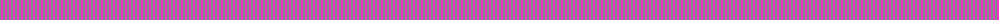

The parent of this is [Une Energie Nouvelle (Corporate) XXX](/tartans/lg/2/lr/2/)

This was sourced from tartans-authority.  It is a [2 stripes tartan](/stripes/stripes2/).

Original link http://www.tartansauthority.com/tartan-ferret/display/2180/

## Thread count
LG/2 LR/2

## Palette
Each colour and its ΔE from the base-6 reference it is a variant of.

| Colour | Shade | Base | ΔE (OKLab) |
|---|---|---|---|
| LG |  `#789484` | G  | 0.23 |
| LR |  `#EC34C4` | R  | 0.24 |

# Sample pattern

ID: /variants/lg/2/lr/2-lg789484-lrec34c4/
