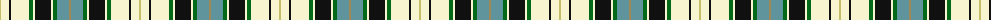

The parent of this is [Tiree](/tartans/lg/2/ly8/k2/ly18/g4/ly2/k16/ly2/g4/b12/lt/2/)

This was sourced from register-of-tartans.  It is a [11 stripes tartan](/stripes/stripes11/).

Original link https://www.tartanregister.gov.uk/tartanDetails.aspx?ref=4129

## Thread count
LG/2 LY8 K2 LY18 G4 LY2 K16 LY2 G4 B12 LT/2

## Palette
Each colour and its ΔE from the base-6 reference it is a variant of.

| Colour | Shade | Base | ΔE (OKLab) |
|---|---|---|---|
| B |  `#60949C` | G  | 0.24 |
| G |  `#006818` | G  | 0.02 |
| K |  `#101010` | K  | 0.17 |
| LG |  `#C4BC68` | Y  | 0.07 |
| LT |  `#A08858` | Y  | 0.21 |
| LY |  `#F8F4D0` | W  | 0.04 |

ID: /variants/lg/2/ly8/k2/ly18/g4/ly2/k16/ly2/g4/b12/lt/2-b60949c-g006818-k101010-lgc4bc68-lta08858-lyf8f4d0/
