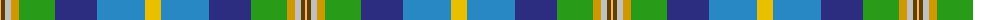
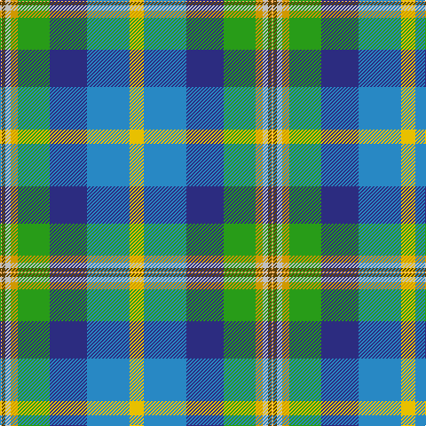

The parent of this is [Philpotts, Brian](/tartans/lg/2/t4/n6/dy8/g36/db42/b48/y/16/)

This was sourced from tartans-authority.  It is a [8 stripes tartan](/stripes/stripes8/).

Original link http://www.tartansauthority.com/tartan-ferret/display/10931/

## Thread count
LG/2 T4 N6 DY8 G36 DB42 B48 Y/16

## Palette
Each colour and its ΔE from the base-6 reference it is a variant of.

| Colour | Shade | Base | ΔE (OKLab) |
|---|---|---|---|
| B |  `#2888C4` | B  | 0.21 |
| DB |  `#2C2C80` | B  | 0.05 |
| DY |  `#D09800` | Y  | 0.11 |
| G |  `#289C18` | G  | 0.18 |
| LG |  `#FCB464` | Y  | 0.08 |
| N |  `#C0C0C0` | W  | 0.16 |
| T |  `#604000` | G  | 0.14 |
| Y |  `#E8C000` | Y  | 0.00 |

# Sample pattern

ID: /variants/lg/2/t4/n6/dy8/g36/db42/b48/y/16-b2888c4-db2c2c80-dyd09800-g289c18-lgfcb464-nc0c0c0-t604000-ye8c000/
