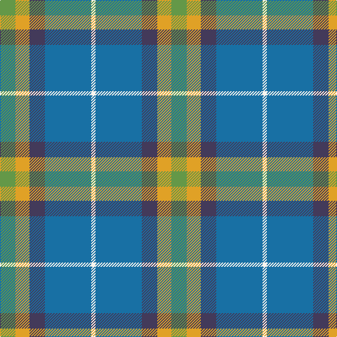

The parent of this is [Sterling, Rob (Florida) (Personal)](/tartans/lg/22/y20/n22/b66/w/6/)

This was sourced from register-of-tartans.  It is a [5 stripes tartan](/stripes/stripes5/).

Original link https://www.tartanregister.gov.uk/tartanDetails.aspx?ref=10653

## Thread count
LG/22 Y20 N22 B66 W/6

## Palette
Each colour and its ΔE from the base-6 reference it is a variant of.

| Colour | Shade | Base | ΔE (OKLab) |
|---|---|---|---|
| B |  `#1870A4` | B  | 0.14 |
| LG |  `#649848` | G  | 0.19 |
| N |  `#433A5A` | B  | 0.08 |
| W |  `#F9F5EF` | W  | 0.01 |
| Y |  `#E0A126` | Y  | 0.08 |

# Sample pattern

ID: /variants/lg/22/y20/n22/b66/w/6-b1870a4-lg649848-n433a5a-wf9f5ef-ye0a126/
