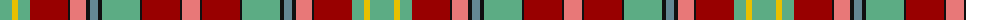

The parent of this is [Golden Broom (Corporate)](/tartans/lg/24/y6/lg12/dr38/k2/lr16/k4/b8/k4/lg38/k2/dr38/k2/lr/18/)

This was sourced from tartans-authority.  It is a [14 stripes tartan](/stripes/stripes14/).

Original link http://www.tartansauthority.com/tartan-ferret/display/7072/

## Thread count
LG/24 Y6 LG12 DR38 K2 LR16 K4 B8 K4 LG38 K2 DR38 K2 LR/18

## Palette
Each colour and its ΔE from the base-6 reference it is a variant of.

| Colour | Shade | Base | ΔE (OKLab) |
|---|---|---|---|
| B |  `#648894` | G  | 0.22 |
| DR |  `#980000` | R  | 0.10 |
| K |  `#101010` | K  | 0.17 |
| LG |  `#5CAC84` | Y  | 0.21 |
| LR |  `#E87878` | R  | 0.19 |
| Y |  `#E8C000` | Y  | 0.00 |

ID: /variants/lg/24/y6/lg12/dr38/k2/lr16/k4/b8/k4/lg38/k2/dr38/k2/lr/18-b648894-dr980000-k101010-lg5cac84-lre87878-ye8c000/
