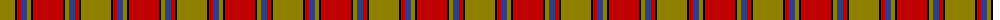
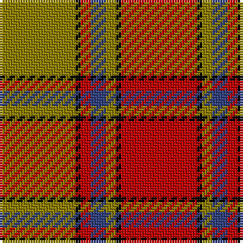

The parent of this is [Scrymgeour](/tartans/lg/30/k2/r4/b6/lg4/k2/r/30/)

This was sourced from weddslist.  It is a [7 stripes tartan](/stripes/stripes7/).

Original link http://www.weddslist.com/cgi-bin/tartans/pg.pl?source=sts

## Thread count
LG/30 K2 R4 B6 LG4 K2 R/30

## Palette
Each colour and its ΔE from the base-6 reference it is a variant of.

| Colour | Shade | Base | ΔE (OKLab) |
|---|---|---|---|
| B |  `#304080` | B  | 0.01 |
| K |  `#000000` | K  | 0.00 |
| LG |  `#908000` | G  | 0.19 |
| R |  `#C00000` | R  | 0.02 |

# Sample pattern

ID: /variants/lg/30/k2/r4/b6/lg4/k2/r/30-b304080-k000000-lg908000-rc00000/
