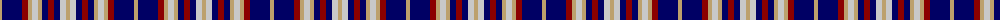

The parent of this is [Unidentified #55](/tartans/lg/4/db20/dr6/lg4/n6/lg4/db6/dr6/db6/n6/lg/4/)

This was sourced from register-of-tartans.  It is a [11 stripes tartan](/stripes/stripes11/).

Original link https://www.tartanregister.gov.uk/tartanDetails.aspx?ref=4256

## Thread count
LG/4 DB20 DR6 LG4 N6 LG4 DB6 DR6 DB6 N6 LG/4

## Palette
Each colour and its ΔE from the base-6 reference it is a variant of.

| Colour | Shade | Base | ΔE (OKLab) |
|---|---|---|---|
| DB |  `#000064` | B  | 0.17 |
| DR |  `#8C0000` | R  | 0.13 |
| LG |  `#BCA06C` | Y  | 0.14 |
| N |  `#C8C8C8` | W  | 0.13 |

ID: /variants/lg/4/db20/dr6/lg4/n6/lg4/db6/dr6/db6/n6/lg/4-db000064-dr8c0000-lgbca06c-nc8c8c8/
