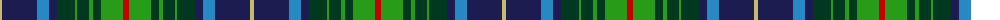

The parent of this is [Bruntsfield Links Golfing Soc. (Corp](/tartans/lg/4/db35/b12/db8/dg18/g2/dg12/g4/dg8/g22/r/6/)

This was sourced from tartans-authority.  It is a [11 stripes tartan](/stripes/stripes11/).

Original link http://www.tartansauthority.com/tartan-ferret/display/10316/

## Thread count
LG/4 DB35 B12 DB8 DG18 G2 DG12 G4 DG8 G22 R/6

## Palette
Each colour and its ΔE from the base-6 reference it is a variant of.

| Colour | Shade | Base | ΔE (OKLab) |
|---|---|---|---|
| B |  `#2888C4` | B  | 0.21 |
| DB |  `#1C1C50` | B  | 0.14 |
| DG |  `#003820` | G  | 0.16 |
| G |  `#289C18` | G  | 0.18 |
| LG |  `#C4BC68` | Y  | 0.07 |
| R |  `#C80000` | R  | 0.00 |

ID: /variants/lg/4/db35/b12/db8/dg18/g2/dg12/g4/dg8/g22/r/6-b2888c4-db1c1c50-dg003820-g289c18-lgc4bc68-rc80000/
