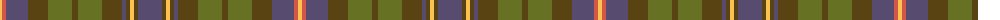

The parent of this is [MacVicar, McVicar, McVicker](/tartans/lg/4/do4/n22/t20/g24/t6/g24/t20/n4/t4/lg4/t4/n/24/)

This was sourced from register-of-tartans.  It is a [13 stripes tartan](/stripes/stripes13/).

Original link https://www.tartanregister.gov.uk/tartanDetails.aspx?ref=10032

## Thread count
LG/4 DO4 N22 T20 G24 T6 G24 T20 N4 T4 LG4 T4 N/24

## Palette
Each colour and its ΔE from the base-6 reference it is a variant of.

| Colour | Shade | Base | ΔE (OKLab) |
|---|---|---|---|
| DO |  `#D45647` | R  | 0.11 |
| G |  `#667123` | G  | 0.11 |
| LG |  `#FCC254` | Y  | 0.05 |
| N |  `#574B6F` | B  | 0.09 |
| T |  `#594312` | G  | 0.13 |

ID: /variants/lg/4/do4/n22/t20/g24/t6/g24/t20/n4/t4/lg4/t4/n/24-dod45647-g667123-lgfcc254-n574b6f-t594312/
