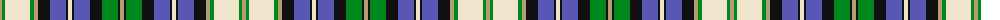

The parent of this is [Lochalsh (Fashion)](/tartans/lg/4/g3/w25/g4/lg4/k12/b16/k2/w4/k2/b16/k12/g16/k2/lg/4/)

This was sourced from tartans-authority.  It is a [15 stripes tartan](/stripes/stripes15/).

Original link http://www.tartansauthority.com/tartan-ferret/display/6133/

## Thread count
LG/4 G3 W25 G4 LG4 K12 B16 K2 W4 K2 B16 K12 G16 K2 LG/4

## Palette
Each colour and its ΔE from the base-6 reference it is a variant of.

| Colour | Shade | Base | ΔE (OKLab) |
|---|---|---|---|
| B |  `#5858B4` | B  | 0.12 |
| G |  `#00881C` | G  | 0.11 |
| K |  `#101010` | K  | 0.17 |
| LG |  `#B49C74` | Y  | 0.16 |
| W |  `#F0E4CC` | W  | 0.05 |

ID: /variants/lg/4/g3/w25/g4/lg4/k12/b16/k2/w4/k2/b16/k12/g16/k2/lg/4-b5858b4-g00881c-k101010-lgb49c74-wf0e4cc/
